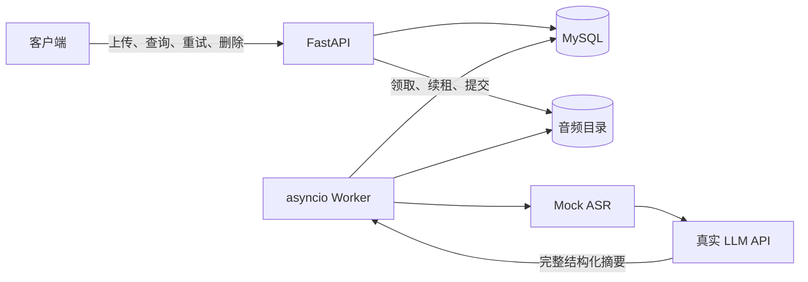

# 录音转写服务 API

基于 Python 3.12、FastAPI、MySQL 8.0 和独立 asyncio Worker，实现录音上传、异步 Mock 转写及真实 LLM 结构化摘要。

服务支持录音与任务查询、分页、失败任务手动重试和可恢复删除，并提供自动重试、重启恢复、SHA-256 去重及每个 Worker 最多 3 个任务并发。

## 启动

复制 `.env.example` 为 `.env`，设置数据库密码、LLM 地址、模型和密钥；已有配置应保留。真实配置只放在忽略的环境文件或进程环境中。

安装 Docker 和 Compose 后执行：

```text
docker compose config --quiet
docker compose up --build -d
```

使用独立 `.env.docker` 时，每条 Compose 命令加 `--env-file .env.docker`。Compose 启动 MySQL、执行迁移，再启动 API 和 Worker。访问 http://127.0.0.1:8000/docs 调用接口。

已有 MySQL 的本地运行方式：

```text
uv sync --frozen
uv run --frozen alembic upgrade head
uv run --frozen uvicorn app.main:create_app --factory --host 127.0.0.1 --port 8000 --no-access-log
```

另开终端执行 `uv run --frozen python -m app.worker`。两个进程须使用同一数据库和音频目录。具体配置见 [运行与开发](docs/development.md)。

## 处理流程



上传完成文件保存和数据库事务后立即返回，客户端轮询任务：`pending → transcribing → summarizing → done`。Mock ASR 默认耗时 5–15 秒、约 20% 概率失败，产出模拟文本。LLM 返回完整 JSON，经严格校验后保存 `summary`、`key_points`、`todos`。

失败阶段共享最多 3 次自动重试，默认退避 2/4/8 秒，预算耗尽进入 `failed`；手动重试创建新任务。排队任务保存在数据库中，处理中任务在租约到期后恢复，摘要阶段复用已有转写。

## 数据与取舍

`recordings` 保存文件元数据、内容哈希与删除标记；`tasks` 保存处理状态、结果、错误、重试关系及租约。迁移顺序为 `0001_recordings_tasks → 0002_task_auto_retries → 0003_recording_hash`，字段与约束见 [设计](docs/design.md)。

MySQL 同时作为业务存储和持久化队列，减少运行组件。外部调用在事务外执行；短事务、行锁及租约令牌防止旧执行覆盖新结果。删除先标记再清理文件及关联数据，中断后由 Worker 补偿。

文件与数据库无法原子提交，极端中断可能留下孤立文件，可使用只读 [存储审计工具](scripts/audit-storage.py) 核查。外部 LLM 属于至少一次调用，重启可能重复请求。并发限制按进程计算，Compose 默认启动一个 Worker。

本项目提供本地交付，无鉴权、前端和公网部署；Mock 转写不代表录音真实内容。迁移前须备份数据库和音频，哈希迁移遇到重复或缺失文件会停止。接口就绪只表示 API 与数据库可用，完整处理还依赖 Worker 和 LLM 服务。

## 阅读入口

| 文档 | 内容 |
| --- | --- |
| [需求](docs/requirements.md) | 功能范围与交付约定 |
| [设计](docs/design.md) | 状态、数据、接口与一致性规则 |
| [运行与开发](docs/development.md) | 配置、启动、迁移和手动核查 |
| [HTTP 调试文件](requests/recordings.http) | 六个业务接口的调用示例 |
