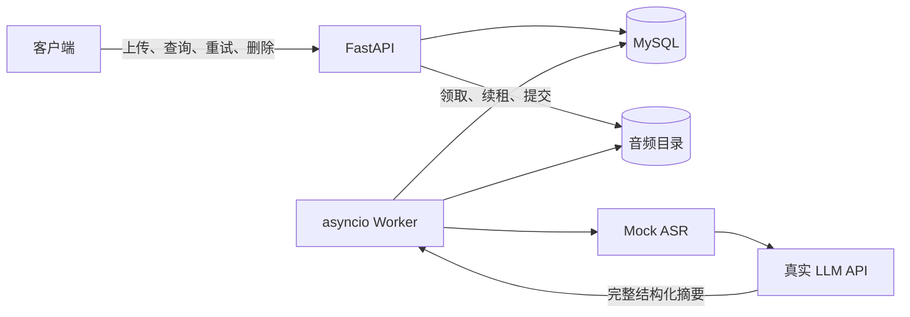

# 录音转写服务 API

基于 Python 3.12、FastAPI、MySQL 8.0 和独立 asyncio Worker，实现录音上传、异步 Mock 转写及真实 LLM 结构化摘要。

服务支持录音与任务查询、分页、失败任务手动重试和可恢复删除，并提供自动重试、重启恢复、SHA-256 去重及每个 Worker 最多 3 个任务并发。

本项目对应笔试题中的“录音转写服务”要求。必做功能为上传、异步转写与摘要、任务查询、分页、重试和删除；自动重试、重启恢复、上传幂等和并发控制作为扩展能力实现。项目不包含注册登录、鉴权、前端和高并发性能优化。

## 功能与接口契约

### 接口列表

| 方法与路径 | 功能 |
| --- | --- |
| POST /v1/recordings | 上传音频，返回录音和初始任务 ID；按内容去重 |
| GET /v1/tasks/{task_id} | 查询处理阶段、结果、重试等待和失败原因 |
| GET /v1/recordings | 倒序分页查询录音及最新任务状态 |
| GET /v1/recordings/{recording_id} | 查询录音详情、转写及完成后的摘要 |
| POST /v1/tasks/{task_id}/retry | 为失败任务创建或取得后继任务 |
| DELETE /v1/recordings/{recording_id} | 删除音频与关联数据 |

上传字段为 multipart `file`，允许 wav/mp3/m4a/aac，文件非空且不超过 50 MiB。完整接口与错误契约见 [设计文档](docs/design.md)，调用示例见 [HTTP 文件](requests/recordings.http) 或 [Postman 集合](requests/recording-transcription.postman_collection.json)。

上传接口在文件落盘和数据库事务提交后立即返回，不等待转写。新任务返回 `202` 和 `pending`；相同文件的重复上传返回 `200` 并复用已有录音和初始任务。统一错误结构为 `{"error":{"code":"...","message":"...","request_id":"..."}}`，参数、资源不存在、状态冲突、文件过大和基础设施故障分别使用 `400`、`404`、`409`、`413` 和 `503`。

## 项目结构

```text
app/
  api.py                 # HTTP 路由
  models.py, schemas.py  # 持久化模型与响应契约
  services/              # 上传、查询、重试和删除事务
  processing/            # 任务队列、Mock ASR、LLM
  worker.py              # 并发调度和处理流水线
  config.py, db.py        # 配置与数据库基础设施
  storage.py             # 音频存储及引用对账
  main.py                # API 应用工厂
  errors.py, logging.py  # 统一错误与结构化日志
migrations/              # 数据库结构演进
requests/                # HTTP 和 Postman 调试示例
scripts/                 # 通用启动与只读存储审计工具
docs/                    # 需求、设计和使用说明
```

## 使用与启动

### 方式一：Docker 一键启动（推荐）

适用于 Windows、macOS 和 Linux。先安装并启动 Docker Desktop，然后在项目根目录执行：

```powershell
.\start.ps1
```

首次执行会自动复制 `.env.example` 为 `.env` 并停止，避免使用占位配置。编辑 `.env`，至少填写以下值后再次执行脚本：

```text
MYSQL_PASSWORD=数据库用户密码
MYSQL_ROOT_PASSWORD=数据库 root 密码
LLM_BASE_URL=https://实际模型服务地址/v1
LLM_MODEL=实际可用的模型名
LLM_API_KEY=实际模型密钥
```

脚本随后会检查 Docker、校验 Compose 配置、构建镜像，并按顺序启动 MySQL、数据库迁移、API 和 Worker。启动成功后打开 <http://127.0.0.1:8000/docs>。

常用命令：

```powershell
.\start.ps1 -Rebuild  # 强制重新构建镜像
.\start.ps1 -Logs     # 启动后持续查看 API/Worker 日志
docker compose ps     # 查看服务状态
docker compose down   # 停止服务（保留数据卷）
```

如果使用其他环境文件，可将命令中的环境文件显式传给 Compose，例如 `docker compose --env-file .env.docker up --build -d`。不要执行 `down -v`，否则会删除数据库和录音卷。

### 方式二：本地 Python 分进程启动

适用于已有 MySQL、Python 3.12 和 uv 的开发环境。复制 `.env.example` 为 `.env`，将 `DATABASE_URL` 改为本地 MySQL，并设置 LLM 配置，然后依次执行：

```powershell
uv sync --frozen
uv run --frozen alembic upgrade head
uv run --frozen uvicorn app.main:create_app --factory --host 127.0.0.1 --port 8000 --no-access-log
```

保持 API 进程运行，再打开第二个终端执行：

```powershell
uv run --frozen python -m app.worker
```

API 和 Worker 必须使用相同的数据库和 `UPLOAD_DIR`。Windows 也可以分别运行 `scripts/start-local.ps1` 和 `scripts/start-worker.ps1`。完整参数说明见 [运行与开发](docs/development.md)。

## 架构说明与处理流程



上传完成文件保存和数据库事务后立即返回，客户端轮询任务：`pending → transcribing → summarizing → done`。Mock ASR 默认耗时 5–15 秒、约 20% 概率失败，产出模拟文本。LLM 返回完整 JSON，经严格校验后保存 `summary`、`key_points`、`todos`。

失败阶段共享最多 3 次自动重试，默认退避 2/4/8 秒，预算耗尽进入 `failed`；手动重试创建新任务。排队任务保存在数据库中，处理中任务在租约到期后恢复，摘要阶段复用已有转写。

Worker 每个进程最多同时处理 3 个任务；任务通过 MySQL 行锁、租约令牌和到期时间领取，旧执行无法覆盖新执行结果。进程重启后，排队任务继续领取，过期租约恢复到原阶段。

## 表结构设计说明

`recordings` 保存文件元数据、内容哈希与删除标记；`tasks` 保存处理状态、结果、错误、重试关系及租约。迁移顺序为 `0001_recordings_tasks → 0002_task_auto_retries → 0003_recording_hash`，字段与约束见 [设计](docs/design.md)。

| 表 | 关键字段 | 约束与用途 |
| --- | --- | --- |
| `recordings` | `id`、`original_filename`、`storage_key`、`size_bytes`、`content_sha256` | UUID 主键；存储键和内容哈希唯一；文件大小有上限；`deleted_at` 支持软删除和清理补偿 |
| `tasks` | `id`、`recording_id`、`attempt_no`、`status`、`transcript`、`summary_result`、`error_code`、`error_message`、`lease_token`、`lease_expires_at`、`auto_retry_count`、`next_attempt_at` | 关联录音并记录处理状态、转写、摘要和脱敏错误；`recording_id + attempt_no` 唯一；租约字段支持并发领取和超时恢复；录音删除时级联删除任务 |

所有表结构由 Alembic 迁移维护，不依赖手工执行建表 SQL。当前迁移头为 `0003_recording_hash`。

## 技术取舍

MySQL 同时作为业务存储和持久化队列，减少运行组件。外部调用在事务外执行；短事务、行锁及租约令牌防止旧执行覆盖新结果。删除先标记再清理文件及关联数据，中断后由 Worker 补偿。

文件与数据库无法原子提交，极端中断可能留下孤立文件，可使用只读 [存储审计工具](scripts/audit-storage.py) 核查。外部 LLM 属于至少一次调用，重启可能重复请求。并发限制按进程计算，Compose 默认启动一个 Worker。

## 已知问题与未完成项

当前无鉴权、前端和公网部署方案；Mock 转写不代表录音真实内容。LLM 调用采用至少一次语义，进程异常时可能重复请求。文件系统和数据库不能原子提交，极端中断可能留下孤立文件，需要运行存储审计工具处理。并发上限按 Worker 进程计算，多个 Worker 进程不保证全局 3 并发。迁移前须备份数据库和音频，哈希迁移遇到重复或缺失文件会停止。接口就绪只表示 API 与数据库可用，完整处理还依赖 Worker 和可用的 LLM 服务。

未实现的可选项包括 LLM 流式摘要接口、公网部署和完整自动化测试。并发控制、自动重试和重启恢复需要按 [开发说明](docs/development.md) 进行人工核查。

## 阅读入口

| 文档 | 内容 |
| --- | --- |
| [需求](docs/requirements.md) | 功能范围与交付约定 |
| [设计](docs/design.md) | 状态、数据、接口与一致性规则 |
| [运行与开发](docs/development.md) | 配置、启动、迁移和手动核查 |
| [源码指南](docs/code-guide.md) | 模块职责和阅读顺序 |
| [HTTP 调试文件](requests/recordings.http) | 六个业务接口的调用示例 |
| [健康检查调试](requests/health.http) | 存活、就绪、404 和 405 示例 |
| [Postman 集合](requests/recording-transcription.postman_collection.json) | 可导入 Postman 的完整接口集合 |
| [贡献说明](CONTRIBUTING.md) | 代码规范、提交检查和仓库内容约定 |

当前尚未选择开源许可证，后续以仓库明确发布的许可证为准。
